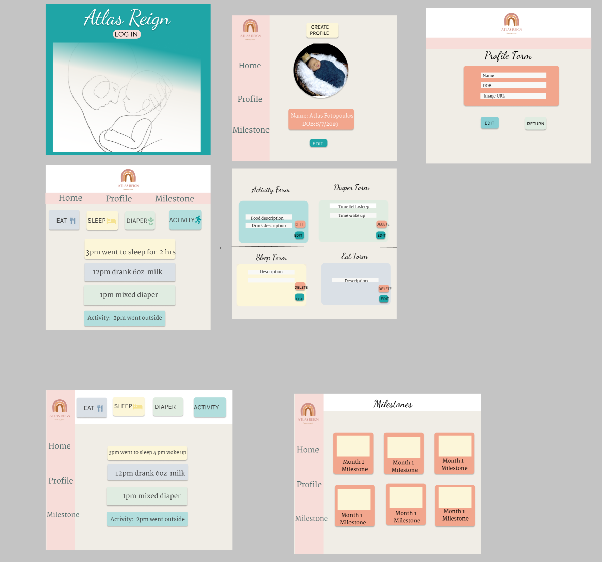

# C47-AtlasReign-Capstone

# Atlas Reign
This app focused on all things Baby! The user will be able to log when their baby eats, sleeps, diapers and activities! The user will also be able to see a Milestone page which will help the user see milestones and red flags to watch out for each month.

## Motivation
My motivation for this project is that I am a stay at home mom myself and keeping track of everything my 1.5 year old does, is rough! Having an app to make it simple and everything be in one spot would help so many moms out there. 

### Figma- https://www.figma.com/file/HqfjZ78NSjh0UW0P65wV4q/front-end-capstone?node-id=0%3A1

### ERD

## Loom 
video presentation of proposal here -
https://www.loom.com/share/82ead49ace564f13aaf30ec4d501acde
